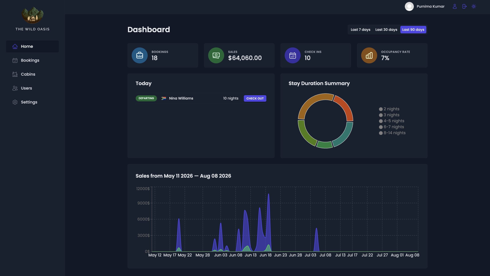
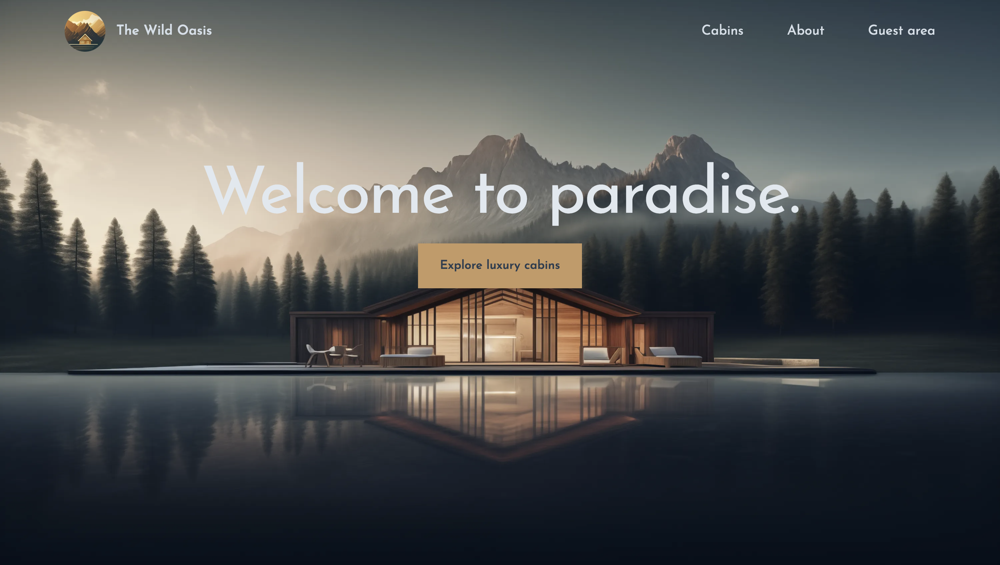
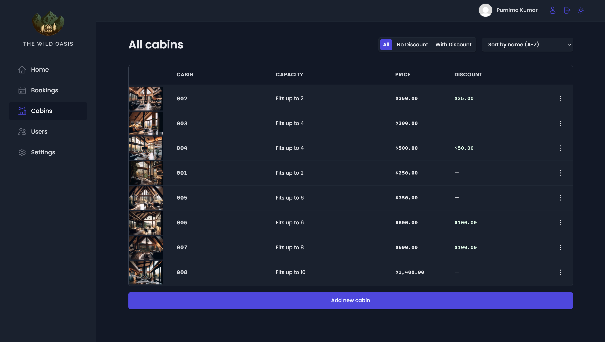
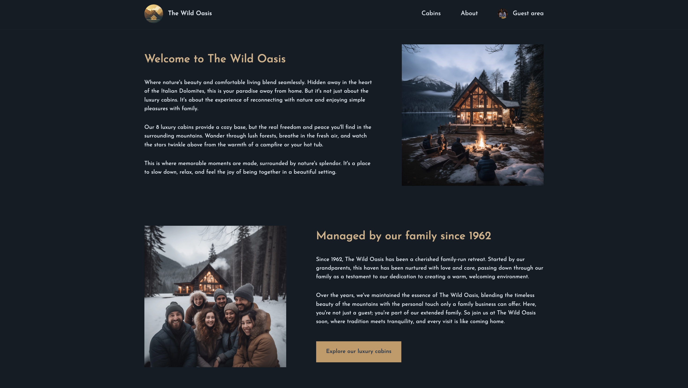
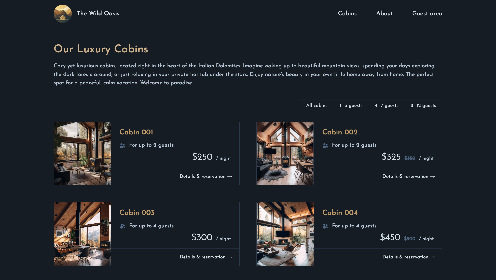
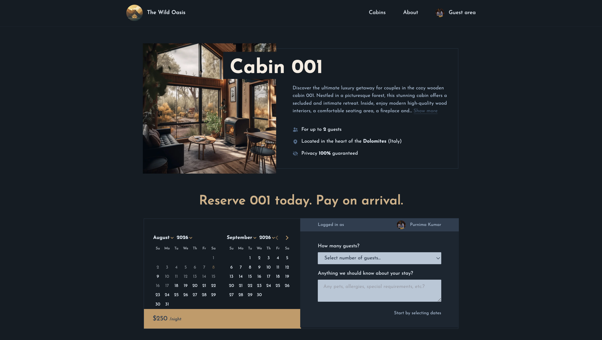
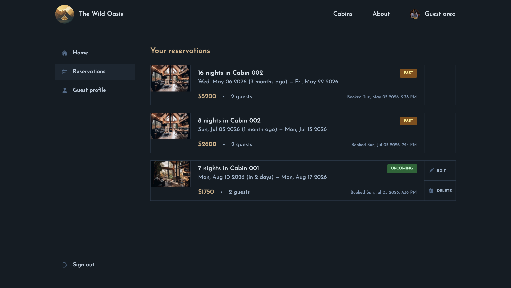
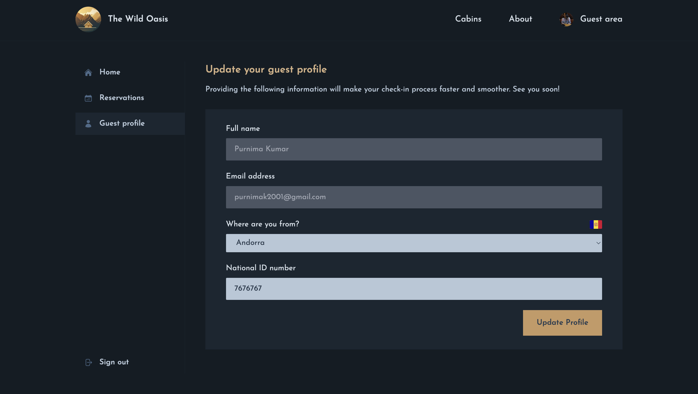

# React Learning Journey

This is my code for the [Ultimate React Course](https://www.udemy.com/course/the-ultimate-react-course/) course by Jonas Schmedtmann on Udemy.

---

## Projects at a glance

| Project                                               | What it is                              | Main technologies                                                                              |
| ----------------------------------------------------- | --------------------------------------- | ---------------------------------------------------------------------------------------------- |
| [The Wild Oasis](./17-The-Wild-Oasis)                 | An internal hotel management dashboard  | React, Vite, React Router, React Query, Supabase, React Hook Form, Styled Components, Recharts |
| [The Wild Oasis Website](./21-The-Wild-Oasis-Website) | A customer-facing cabin booking website | Next.js, React, Supabase, NextAuth, Tailwind CSS                                               |

---

# 1. The Wild Oasis

**Live Demo:** [`wild-oasis-resort.vercel.app`](https://wild-oasis-resort.vercel.app)

The Wild Oasis is an **internal hotel management application**. It is designed for hotel employees to manage cabins, bookings, guests, and day-to-day hotel operations from one dashboard.

### Project screenshot



### What the application can do

- User authentication and protected application areas
- View and manage hotel cabins
- Create, edit, and delete cabins
- View hotel bookings
- Manage booking-related information
- Check guests in and out
- View dashboard statistics and charts
- Manage application settings
- Handle loading and error states
- Use reusable components and feature-based organization

The code is organized around separate features such as **authentication, bookings, cabins, check-in/check-out, dashboard, and settings**, rather than putting the entire application into one large component structure.

### Main technologies

- **React 18** – building the user interface
- **Vite** – development server and build tooling
- **React Router** – client-side routing
- **TanStack React Query** – fetching, caching, and synchronizing server data
- **Supabase** – backend/database services
- **React Hook Form** – handling forms and validation
- **Styled Components** – component-level styling
- **Recharts** – displaying dashboard statistics
- **date-fns** – working with dates
- **React Hot Toast** – user feedback and notifications
- **React Error Boundary** – handling unexpected rendering errors

### What I learned from this project

This project helped me move beyond basic React components and understand how to build a more complete application.

Some of the main concepts I practiced were:

- Structuring a React application by feature
- Separating UI components from data-fetching logic
- Managing server state with React Query
- Working with asynchronous data and loading states
- Creating protected routes and authentication flows
- Building reusable forms
- Handling CRUD operations
- Designing dashboards with charts and statistics
- Managing application-level errors
- Creating reusable custom hooks
- Working with a hosted backend using Supabase

### Project links

- [View source code on GitHub](https://github.com/purnimakumarr/learning-react/tree/main/17-The-Wild-Oasis)

---

# 2. The Wild Oasis Website

**Live Demo:** [`the-wild-oasis-bookings.vercel.app`](https://the-wild-oasis-bookings.vercel.app/)

After building the internal management application, I built a separate **customer-facing website** for The Wild Oasis.

This project was a step forward from a traditional React SPA. I used **Next.js** to learn how React applications can handle routing, server-side functionality, authentication, data access, and application structure in a more full-stack way.

### Project screenshot



### What the website can do

- Browse available cabins
- View individual cabin details
- Select dates for a stay
- Make and manage reservations
- User login and authentication
- View an account area
- Manage existing reservations
- Show loading, error, and not-found states
- Use server-side functionality for application operations
- Store and retrieve application data through Supabase

The application uses the Next.js App Router and organizes pages around routes such as the home page, cabins, account, login, and API functionality.

### Main technologies

- **Next.js 14** – React framework and application structure
- **React 18** – UI development
- **Supabase** – database and data services
- **NextAuth** – authentication
- **Tailwind CSS** – styling
- **date-fns** – date handling
- **React Day Picker** – selecting booking dates
- **Heroicons** – interface icons

### What I learned from this project

This project helped me understand how React fits into a larger full-stack framework.

Some of the main concepts I practiced were:

- Next.js App Router
- File-based routing
- Server and client components
- Server-side data fetching
- Server actions
- Authentication and protected routes
- Working with cookies and sessions
- Connecting a Next.js application to Supabase
- Dynamic routes for individual cabins
- Handling loading and error UI
- Building reusable components
- Creating a customer-facing booking flow
- Using Tailwind CSS to build a responsive interface

### Project links

- [View source code on GitHub](https://github.com/purnimakumarr/learning-react/tree/main/21-The-Wild-Oasis-Website)

---

# From React to Next.js

These two projects represent an important progression in my learning:

```text
React fundamentals
       ↓
Reusable components
       ↓
React Router + application structure
       ↓
Server-state management with React Query
       ↓
Forms, authentication and CRUD operations
       ↓
Supabase integration
       ↓
Dashboard / internal application
       ↓
Next.js
       ↓
Server components + server actions
       ↓
Authentication + database integration
       ↓
Customer-facing booking website
```

The first Wild Oasis project helped me understand how to build a substantial **React SPA**. The second project introduced me to **Next.js and full-stack React development**.

---

# Other React Practice Projects

The repository also contains smaller projects and exercises that I worked through while learning React. These projects focus on individual concepts and helped build the foundation for the larger applications above.

The folder numbering reflects the progression of the original learning course and exercises.

> **Note:** The two Wild Oasis projects are highlighted here because they are the most complete applications in this repository. The smaller projects are kept in the repository as a record of the learning process.

---

# Skills Practiced

### React

- Components and props
- State and event handling
- Hooks
- Custom hooks
- Context API
- Component composition
- Conditional rendering
- Forms
- Error boundaries
- Reusable UI patterns

### Application development

- Client-side routing
- Authentication
- CRUD operations
- Server-state management
- API/data-service integration
- Loading and error states
- Form validation
- Date handling
- Data visualization
- Responsive UI development

### Modern React ecosystem

- Vite
- React Router
- TanStack React Query
- Supabase
- React Hook Form
- Styled Components
- Recharts
- Next.js
- NextAuth
- Tailwind CSS

---

# Screenshots

I will add screenshots of the projects here as I continue documenting them.

### The Wild Oasis – Dashboard


### The Wild Oasis – Bookings



### The Wild Oasis – Cabins


### The Wild Oasis Website – Home / About




### The Wild Oasis Website – Cabin Details





### The Wild Oasis Website – Reservations / Account




